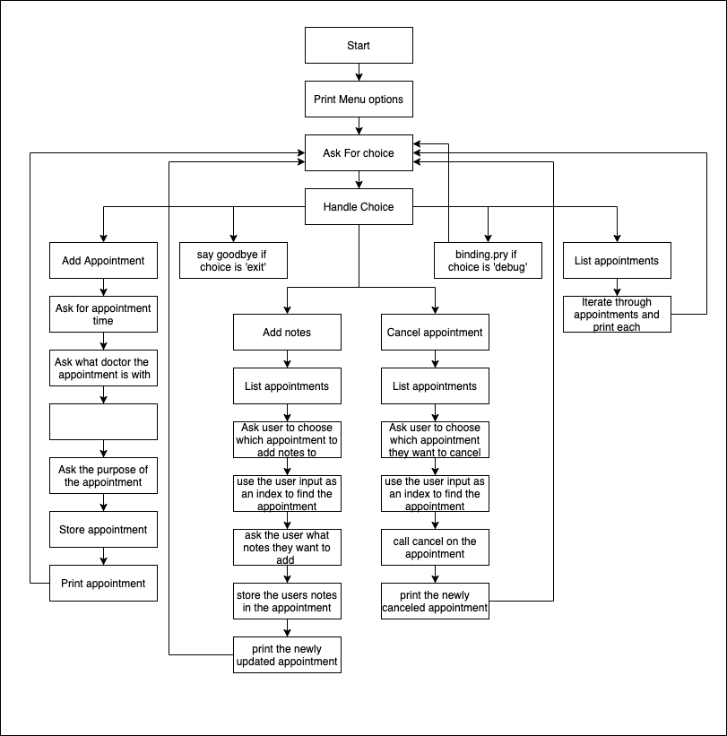

## Appointments CLI Part 2
### Key Features we're going to add to our Appointments CLI:

- Add the ability to add notes to an appointment
- Add the ability to cancel an appointment

### Key Refactors for Appointments CLI

- create an Appointment class
  - attributes for `time`, `doctor`, `patient`, `purpose`, `notes`, `canceled`
  - add a `notes=` method which sets the value of the `@notes` instance variable to whatever argument we pass to it.
  - add a `cancel` method which sets the `canceled` attribute to `true`
  - add a `print` method which will handle printing the appointment information to the standard output
- In CLI
  - Add menu options for adding notes to and canceling appointments
  - After choosing those options, create logic to allow users to choose which appointment they want to add notes to/cancel
  - rework the parts of the cli that were expecting an appointment hash to work with an appointment instance instead.
    - `APPOINTMENTS` should store an array of instances of the `Appointment` class instead of an array of hashes
    - within the `add_appointment` method, we'll create an instance of the `Appointment` class instead of a hash (also notice there's a patient attribute now as well, so we'll need to ask the user for that also)
    - instead of calling `print_appointment` and passing the appointment hash, we'll invoke `print` directly on the appointment

### Logistics

- The code for our cli will be written in the file `lib/appointments_cli.rb`. 
- We'll create another file called `lib/appointment.rb` where we'll define our `Appointment` class
- Again, we'll start our cli application by running the following command in our terminal:

```bash
./bin/run
```



### Advanced Deliverables

- Right now, if our program is in one of our 'submenu' methods (`add_appointment` or `add_notes` or `cancel`) and we type `exit` we won't get the intended result. Think about ways we might allow the user to type exit from anywhere in the CLI and have that leave the program.
- Add a `valid?` method to the `Appointment` class to indicate whether the appointment has all of the required information (non-empty string values) for `time`, `doctor`, `patient` and `purpose`. If it doesn't, don't add the appointment to `APPOINTMENTS` and ask the user to input the appointment information again

### For Reference

#### lib/dog.rb
```rb
class Dog 
  attr_accessor :name, :age, :breed, :favorite_treats, :last_walked_at, :last_fed_at
  def initialize(name, age, breed, favorite_treats)
    @name = name
    @age = age
    @breed = breed
    @favorite_treats = favorite_treats
  end

  def walk
    @last_walked_at = DateTime.now
  end

  def feed
    @last_fed_at = DateTime.now
  end

  def needs_a_walk?
    if @last_walked_at
      @last_walked_at < 4.hours.ago
    else
      true
    end
  end

  def needs_a_meal?
    if @last_fed_at
      @last_fed_at < 6.hours.ago
    else
      true
    end
  end

  def print
    puts ""
    puts self.name.light_green
    puts "  age: #{self.age}"
    puts "  breed: #{self.breed}"
    puts "  favorite_treats: #{self.favorite_treats}"
    puts "  restless: #{self.needs_a_walk?}"
    puts "  hungry: #{self.needs_a_meal?}"
    puts ""
  end

end
```
### lib/dog_walker_cli.rb
```rb
DOGS = []

def start_cli
  puts "hello! Welcome to the Dog Walker CLI"
  main_menu
  handle_user_choice
  puts "Thanks for using the Dog Walker CLI!"
end

def main_menu
  puts "What would you like to do? Type the number that matches your choice or 'exit' to leave the program".cyan
  print_options
end

def print_options
  puts "Here's a list of the options. Type:".cyan
  puts "  1. To add a dog".cyan
  puts "  2. To list dogs".cyan
  puts "  3. Feed a dog".cyan
  puts "  4. Walk a dog".cyan
  puts "  exit to leave the program".cyan
end

def handle_user_choice
  input = gets.chomp
  while input != "exit"
    if input == "1"
      add_dog.print
    elsif input == "2"
      puts "All Dogs"
      DOGS.each do |dog|
        dog.print
      end
    elsif input == "3"
      feed_dog
    elsif input == "4"
      walk_dog
    elsif input == "debug" 
      binding.pry
    else 
      puts "Whoops! I didn't understand your choice".red
    end
    main_menu
    input = gets.chomp
  end
end

def add_dog
  print "What's your dog's name? ".cyan
  dog_name = gets.chomp
  print "What's your dog's age? ".cyan
  dog_age = gets.chomp
  print "What's your dog's breed? ".cyan
  dog_breed = gets.chomp
  print "What are some of your dog's favorite treats? ".cyan
  favorite_treats = gets.chomp
  dog = Dog.new(dog_name, dog_age, dog_breed, favorite_treats)
  DOGS << dog
  dog
end

def feed_dog
  puts "pick the number matching the dog you'd like to feed" 
  DOGS.each.with_index(1) do |dog, index|
    puts "#{index}. #{dog.name}"
  end
  input = gets.chomp
  input_to_index = input.to_i - 1
  dog_to_feed = DOGS[input_to_index]
  dog_to_feed.feed
  dog_to_feed.print
end

def walk_dog
  puts "pick the number matching the dog you'd like to walk" 
  DOGS.each.with_index(1) do |dog, index|
    puts "#{index}. #{dog.name}"
  end
  input = gets.chomp
  input_to_index = input.to_i - 1
  dog_to_walk = DOGS[input_to_index]
  dog_to_walk.walk
  dog_to_walk.print
end
```