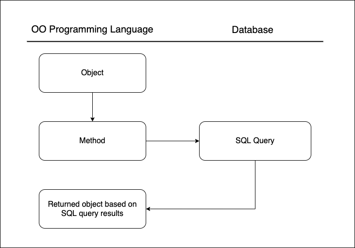
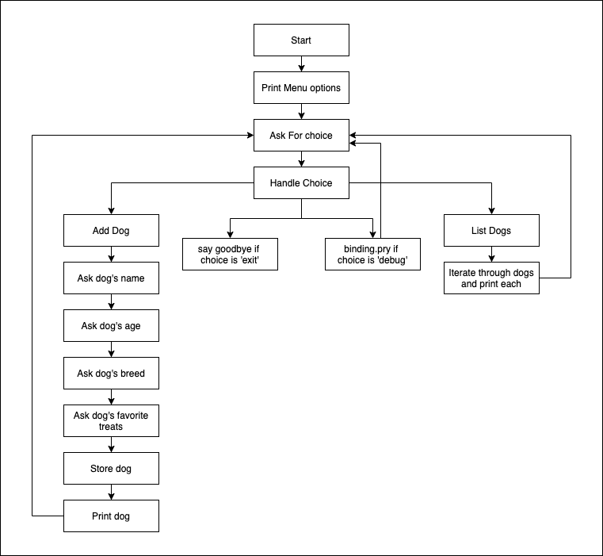

# Intro to Databases

## Key Concepts for the day:

- The benefit of databases in applications
- Relationship between a database and an API
- Domain modeling
- Mapping columns and rows to classes and instances
- Basic SQL queries
- Primary Keys
- Foreign Keys

### What is the significance of the term: Relational Database 

- Store related data in separate tables
- give us the ability to retrieve the data while maintaining the relationship

### ORM Analogy



## Dog Walker CLI Part 3
### Key Features we're going to add to our Dog Walker CLI:

- Add persistence

### Key Refactors for Dog Walker CLI

- Dog class
  - refactor initialize method to use keyword arguments.
  - add a `.all` method and `@@all` class variable to keep track of all the dogs
  - add a `#save` method that will save an instance of the dog class to `@@all`
  - add a `.create(attributes)` method that take attributes as an argument and will instantiate and save a new instance of the dog class.
  - add a `.needs_feeding` method that returns an array of all dogs that need feeding.
  - add a `.needs_walking` method that returns an array of all dogs that need walking.
  
- In CLI
  - Add menu options for viewing all dogs that need feeding and all dogs that need walking.
  - rework the parts of the cli that were expecting to find all of our dogs in `DOGS` to use the `Dog.all` method instead.
    - we'll use `Dog.all` instead of `DOGS` to access the array of Dog instances
    - within the `add_dog` method, we'll create an instance of the `Dog` class using the `.create` method

### Logistics

- The code for our cli will be written in the file `lib/dog_walker_cli.rb`. 
- Our class methods will be written in `lib/dog.rb` where our `Dog` class is defined.
- Again, we'll start our cli application by running the following command in our terminal:

```bash
./bin/run
```

Here's a sketch of the flow of the program we're going to create:

